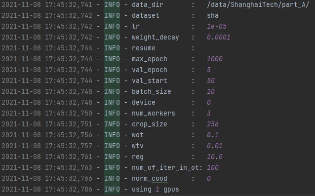

# dm_count

해당 내용은 2021년 2학기 컴퓨터비전에서 사용하는 군중 계산 관련 데이터입니다.

데이터셋은 data 폴더 내에 있으며, 해당 데이터에 문제가 있을 경우 다운받아 Part A만 사용하시기 바랍니다.

링크 주소 : https://www.kaggle.com/tthien/shanghaitech

## Env
requirements.txt의 torch 버전 이상으로 설치하셔도 문제 없습니다.
pytorch 1.10.0 버전으로 테스트 시 이상 없이 진행되었으니, 본인의 CUDA 버전에 맞는 torch 버전으로 진행하시면 됩니다.
가능하다면 꼭 본인의 CUDA에 해당하는 pytorch를 설치하여 GPU가 동작하도록 구성하시는 것을 추천드립니다.

## Process
train -> test -> val 로 진행하며, 최종 val을 통해 result 폴더의 submission.csv로 저장하게 됩니다.
test와 val에 사용하는 모델은 train을 통해 발생한 best_model.pth입니다. 

1. train

```
python train.py --dataset sha --data-dir <path to dataset> --device <gpu device id>
```



2. test
```
python test.py --model-path <path of the model to be evaluated> --data-path <directory for the dataset> --dataset sha
```

3. val
```
python val.py --model-path <path of the model to be evaluated>
```

4. 예시
기본 설정된 argument를 수정하고 싶으신 경우, 각 train.py, test.py, val.py의 ArgumentParser를 확인하시고
위의 명령어에 추가하시면 됩니다.

다음은 예시입니다.
```
python train.py --dataset sha --data-dir data/ShanghaiTech/part_A/ --device 0 --num-workers 1 --max-epoch 500
```

## References
If you find this work or code useful, please cite:

```
@inproceedings{wang2020DMCount,
  title={Distribution Matching for Crowd Counting},
  author={Boyu Wang and Huidong Liu and Dimitris Samaras and Minh Hoai},
  booktitle={Advances in Neural Information Processing Systems},
  year={2020},
}
```
